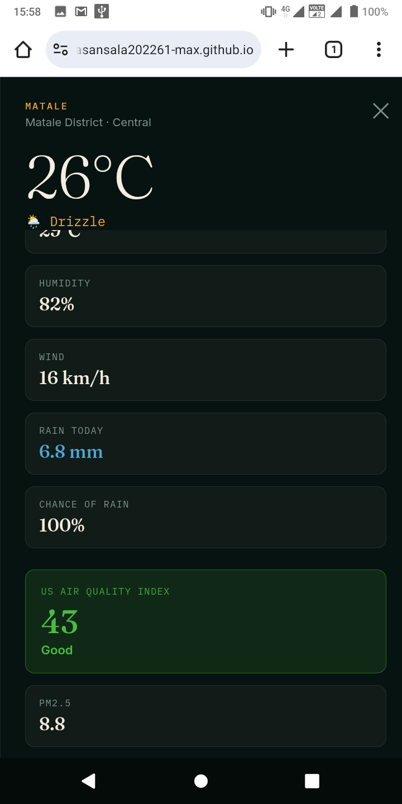
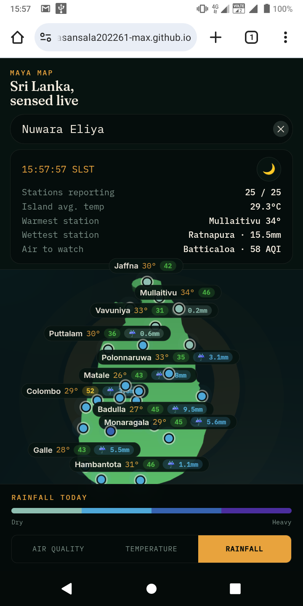
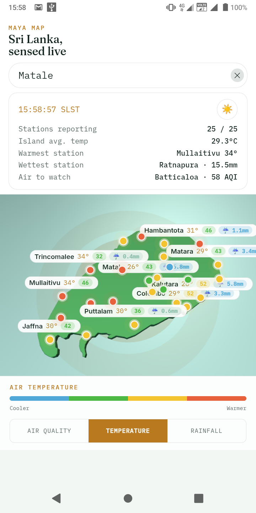
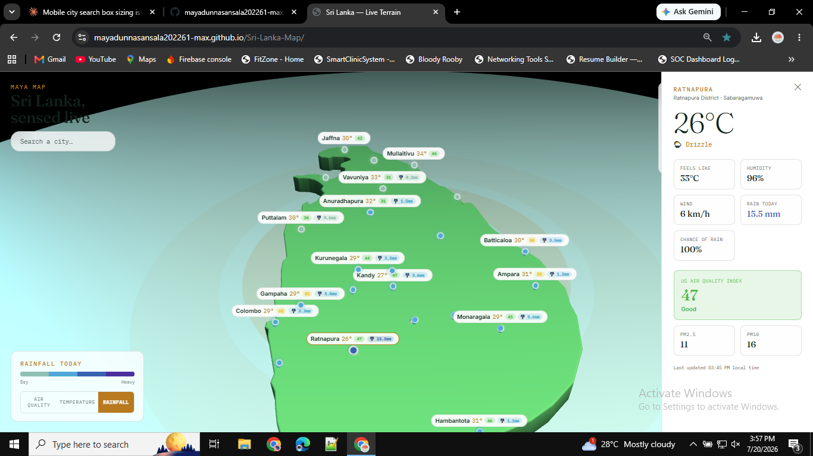
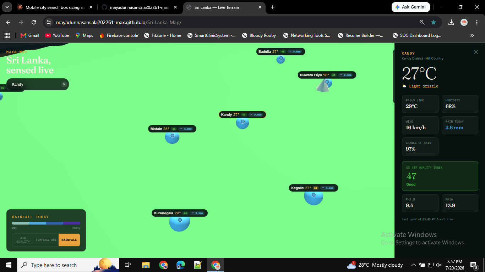
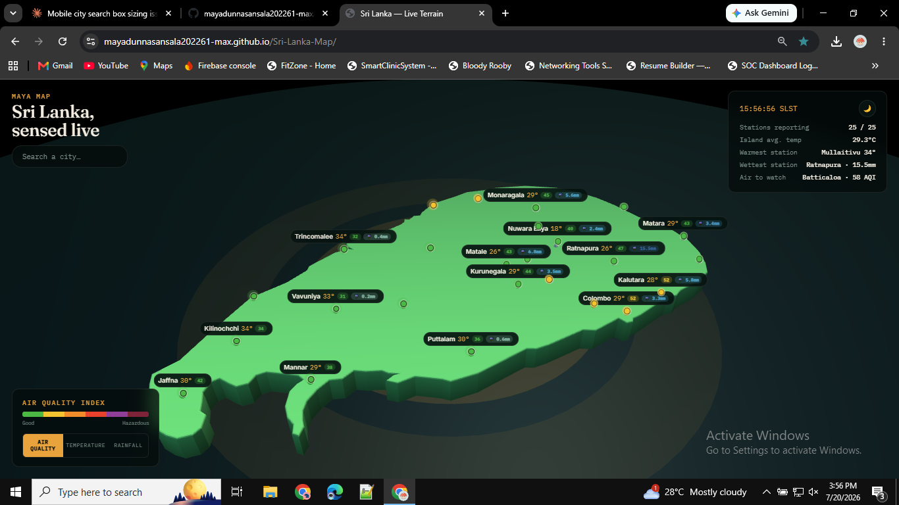

# 🗺️ Maya Map — Sri Lanka, Sensed Live

A 3D, real-time weather and air-quality map of Sri Lanka. Every district station updates live — temperature, rainfall, humidity, wind, and US AQI — rendered on an interactive terrain you can rotate, zoom, and search.

**🔗 Live demo:** [mayadunnasansala202261-max.github.io/Sri-Lanka-Map](https://mayadunnasansala202261-max.github.io/Sri-Lanka-Map/)

---

## ✨ Features

- **Live data for 25 stations** — temperature, feels-like, humidity, wind, rainfall, chance of rain, and US Air Quality Index, sourced from [Open-Meteo](https://open-meteo.com/).
- **Interactive 3D terrain** — drag to rotate, scroll/pinch to zoom, tap a station to see its full detail panel.
- **City search** — jump straight to any of the 25 stations by name, with autocomplete suggestions.
- **Three data modes** — toggle the map overlay between Air Quality, Temperature, and Rainfall.
- **Dark & light themes** — switch instantly with the theme toggle.
- **Fully responsive** — a dedicated mobile layout with a slide-up detail panel, built for phones as much as desktops.

---

## 📸 Screenshots

### Mobile

| Search | Dark mode | Light mode |
|:---:|:---:|:---:|
|  |  |  |

### Desktop

| Light mode | Search | Dark mode |
|:---:|:---:|:---:|
|  |  |  |

---

## 🛠️ Tech stack

- **[Three.js](https://threejs.org/)** (r128) for the 3D terrain, camera, and station markers
- **Vanilla JavaScript, HTML, CSS** — no build step, no framework
- **[Open-Meteo API](https://open-meteo.com/)** for live weather and air-quality data
- Hosted on **GitHub Pages**

---

## 🎬 How the 3D map works

The terrain isn't a static image — it's a live [Three.js](https://threejs.org/) scene, and everything on it is driven by real-time math running every frame.

- **The terrain itself** is an extruded island mesh sitting on an ocean plane, lit with a soft directional light and fog that fades the horizon into the background — that's what gives it the sense of depth rather than looking like a flat map.

- **Camera orbit** isn't Three.js's built-in `OrbitControls` — it's a custom controller built from three values: `azimuth` (rotation around the island), `polar` (tilt up/down), and `radius` (zoom distance). Every drag or scroll updates a *target* for these values, and the actual camera eases toward that target a little each frame (`current += (target - current) * ease`). That's what makes the rotation feel smooth even when your finger or mouse sends jumpy, uneven movement events — the camera is always chasing a goal rather than snapping straight to your input.

- **Momentum** works the same way: when you flick and release, the last frame's angular velocity keeps being applied and decays exponentially over time, so the globe keeps coasting briefly instead of stopping dead — like flicking a real spinning object.

- **Flying to a city** (via search, or double-clicking a marker) animates `radius` down to a close-up value and re-points the camera's look-at target at that city's world position, using the same easing system — so it reads as one continuous camera move rather than a jump cut.

- **Station markers** are 3D pins in the scene, but their name labels are actual HTML elements laid *on top* of the canvas. Every frame, each marker's 3D position is projected into 2D screen coordinates (`vector.project(camera)`), and the label's `left`/`top` CSS is updated to match — that's how a label can "stick" to a point in 3D space as you rotate and zoom.

- **Label decluttering** runs right after that projection step: if two labels would overlap on screen (common when several stations cluster together), the lower-priority one collapses down to just its dot, so text never renders on top of text.

- **Live colors and values** — each marker's dot color, temperature readout, and AQI badge update reactively as data streams in from the weather API, without needing to reload the page or rebuild the scene.

---

*Data provided by [Open-Meteo](https://open-meteo.com/) — free weather and air quality APIs.*
